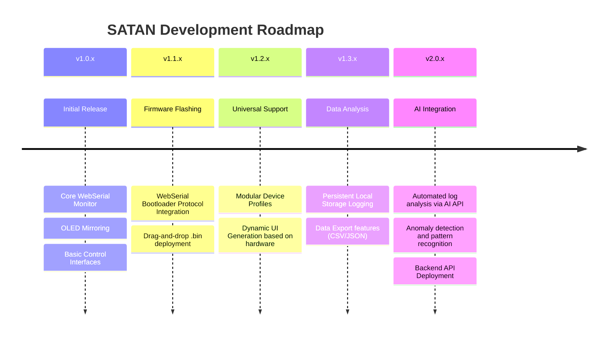

# SATAN v1.0.0

Universal Serial Monitor for ESP32 Microcontrollers

---

## Overview

SATAN (Serial Access Terminal & Analysis Node) is a universal web-based serial monitor and controller designed for ESP32-based microcontroller projects. It establishes a connection via the WebSerial API, providing real-time serial logging, OLED display mirroring, hardware tool controls, and remote device management directly from a supported browser environment. 

This architecture enables a purely client-side application requiring no local installation, system drivers, or local software dependencies.

## Features

- Real-time Serial Monitor: Live serial logging with categorized tagging, timestamps, and log level filtering.
- OLED Display Mirroring: Real-time rendering of the connected device's 128x64 OLED screen via canvas interpolation.
- Remote Control Interfaces: Integrated controls for IR protocols, debugging interfaces, and directional pad navigation.
- Hardware Management: Device reset, software reboot, and connection state management.
- WebSerial Integration: Driverless serial communication via Chromium-based browsers.

## Tech Stack

| Component | Technology |
|-----------|-----------|
| Frontend | React 19, TypeScript |
| Styling | Tailwind CSS v4 |
| Build System | Vite 6 |
| Serial Interface | WebSerial API |

---

## Development Roadmap

The following visual roadmap outlines the planned development phases and upcoming feature integrations. Updates will be published incrementally as they achieve stability.

---

## Author

mxsourav

## License

MIT License
